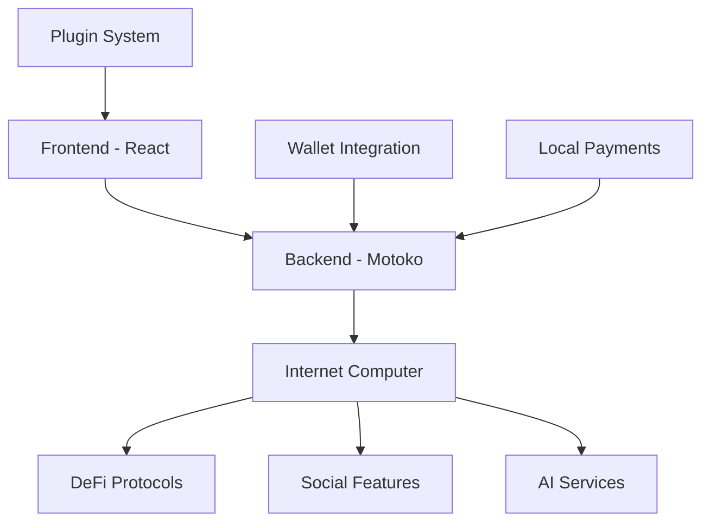

# 🚀 NISTO - The Future of Social Finance

<div align="center">


**The World's First Social Finance Platform on the Internet Computer**  
*Where DeFi Meets Social Innovation*

[](https://github.com/KezzyNgotho/Nisto/stargazers)
[](https://github.com/KezzyNgotho/Nisto/network)
[](https://github.com/KezzyNgotho/Nisto/issues)
[](https://github.com/KezzyNgotho/Nisto/pulls)
[](https://opensource.org/licenses/MIT)

</div>

---

## 🌟 Why Nisto

Nisto isn't just another DeFi platform—it's a **revolutionary social finance ecosystem** that combines the power of decentralized finance with the connectivity of social networks. Built on the Internet Computer, Nisto offers unprecedented scalability, security, and user experience.

### 🏆 **Competitive Advantages**

- **🔗 True Decentralization**: Built on Internet Computer, not just Ethereum
- **👥 Social-First Design**: Community-driven features that traditional DeFi lacks
- **🎮 Gamified Experience**: Trading games, challenges, and leaderboards
- **🤖 AI-Powered Insights**: Personalized financial recommendations
- **🔌 Extensible Ecosystem**: Plugin marketplace for developers
- **🌍 Global Accessibility**: Local payment integrations (M-Pesa, Airtel Money)
- **🛡️ Advanced Security**: Multi-method recovery and robust security

---

## 🎯 **Core Value Propositions**

### 💰 **Unified Financial Hub**
- **Multi-Currency Wallets**: Support for all major cryptocurrencies
- **DeFi Integration**: Staking, lending, yield farming in one place
- **Portfolio Analytics**: Real-time tracking and performance insights
- **Group Vaults**: Collaborative savings and investment pools

### 🎮 **Social Trading Revolution**
- **Trading Challenges**: Compete with friends and community
- **Leaderboards**: Global and local rankings
- **Social Signals**: Share strategies and insights
- **Community Vaults**: Pool resources for better yields

### 🛠️ **Developer Ecosystem**
- **Plugin Marketplace**: Build and monetize financial tools
- **Open APIs**: Integrate with existing DeFi protocols
- **Mini-App Framework**: Create specialized financial applications
- **Revenue Sharing**: Earn from your contributions

---

## 🚀 **Getting Started**

### **Prerequisites**
- Node.js 18+ 
- DFX (Internet Computer SDK)
- Git

### **Quick Start**
```bash
# Clone the repository
git clone https://github.com/KezzyNgotho/Nisto.git
cd Nisto

# Install dependencies
npm install

# Start local Internet Computer replica
dfx start --background

# Deploy canisters
dfx deploy

# Start the frontend
cd src/Nisto_frontend
npm start
```

### **Production Deployment**
```bash
# Deploy to mainnet
dfx deploy --network ic

# Build for production
npm run build
```

---

## 🏗️ **Architecture**

<div align="center">



</div>

### **Tech Stack**
- **Frontend**: React 18, TypeScript, Vite, SCSS
- **Backend**: Motoko (Internet Computer)
- **Authentication**: Internet Identity
- **Styling**: Modern CSS with animations
- **Deployment**: Internet Computer canisters

---

## 🏗️ **Detailed Module Architecture**

### **Backend Modules (Motoko)**

#### **🔐 Authentication & Security Module**
- **User Management**: Complete user lifecycle with preferences and settings
- **Recovery System**: Multi-method account recovery (email, phone, security questions, emergency contacts)
- **Session Management**: Secure login sessions with device tracking
- **Audit Logging**: Comprehensive security audit trails
- **Two-Factor Authentication**: Enhanced security with 2FA support

#### **💰 Wallet & Transaction Module**
- **Multi-Currency Wallets**: Support for Bitcoin, Ethereum, Internet Computer, and more
- **External Wallet Integration**: Connect existing wallets (MetaMask, WalletConnect)
- **Transaction Management**: Complete transaction lifecycle with status tracking
- **Portfolio Analytics**: Real-time balance tracking and performance metrics
- **Address Management**: Unlimited wallet addresses with labeling

#### **🏦 DeFi Integration Module**
- **Protocol Support**: Integration with major DeFi protocols
- **Yield Farming**: Automated yield optimization strategies
- **Lending & Borrowing**: Collateralized lending with competitive rates
- **Staking Rewards**: Passive income through staking mechanisms
- **Position Tracking**: Real-time DeFi position monitoring

#### **👥 Group Vaults Module**
- **Vault Creation**: Customizable vault types (savings, investment, emergency)
- **Member Management**: Role-based access control (owner, admin, member)
- **Transaction Approval**: Multi-signature transaction workflows
- **Contribution Tracking**: Automated contribution and withdrawal tracking
- **Vault Analytics**: Performance metrics and member activity

#### **🎮 Social Gaming Module**
- **Trading Challenges**: Competitive trading competitions
- **Game Types**: Various game modes (daily, weekly, tournament)
- **Participant Management**: Player registration and tracking
- **Reward System**: Token rewards and leaderboard rankings
- **Game History**: Complete game and participant history

#### **🤖 AI Assistant Module**
- **Message Types**: Support for text, voice, and structured data
- **Insight Generation**: Personalized financial insights and analysis
- **Recommendation Engine**: AI-powered investment recommendations
- **Risk Assessment**: Portfolio risk analysis and alerts
- **Learning System**: Continuous improvement from user interactions

#### **💳 Local Payment Module**
- **Payment Providers**: Integration with M-Pesa, Airtel Money, and more
- **Transaction Processing**: Complete payment lifecycle management
- **Status Tracking**: Real-time payment status updates
- **Fee Management**: Transparent fee structure and calculations
- **Compliance**: Regulatory compliance and reporting

#### **🔌 Plugin Marketplace Module**
- **Plugin Management**: Complete plugin lifecycle (create, install, update, remove)
- **Category System**: Organized plugin categories (trading, analytics, gaming)
- **Permission System**: Granular permission controls
- **User Plugin States**: Individual user plugin configurations
- **Review System**: Plugin ratings and user reviews

### **Frontend Modules (React)**

#### **📊 Dashboard Module**
- **Overview Tab**: Real-time portfolio summary and quick actions
- **Activity Feed**: Recent transactions and social interactions
- **Statistics Display**: User stats and performance metrics
- **Notification Center**: Real-time notifications and alerts
- **Responsive Design**: Mobile-first responsive layout

#### **🔐 Authentication Module**
- **Login Modal**: Internet Identity integration
- **Recovery Setup**: Multi-step recovery method configuration
- **Security Settings**: Two-factor authentication and privacy controls
- **Session Management**: Automatic session handling and refresh

#### **💳 Crypto Wallets Module**
- **Wallet Dashboard**: Multi-wallet overview and management
- **Transaction History**: Detailed transaction logs with filtering
- **Address Management**: Add, edit, and label wallet addresses
- **Balance Display**: Real-time balance updates with currency conversion
- **Security Features**: Wallet security settings and backup options

#### **🏦 DeFi Tools Module**
- **Portfolio Overview**: Asset allocation and performance charts
- **Yield Farming Interface**: Manage yield farming positions
- **Lending Dashboard**: Borrow and lend with real-time rates
- **Staking Interface**: Stake tokens and track rewards
- **Analytics Tools**: Advanced portfolio analytics and insights

#### **👥 Group Vaults Module**
- **Vault Creation**: Step-by-step vault setup wizard
- **Member Management**: Add, remove, and manage vault members
- **Transaction Approval**: Multi-signature transaction interface
- **Vault Analytics**: Performance metrics and member activity
- **Public Vaults**: Discover and join public vaults

#### **🎮 Social Games Module**
- **Game Lobby**: Browse and join available games
- **Trading Interface**: In-game trading with real-time updates
- **Leaderboards**: Global and local player rankings
- **Reward Display**: Token rewards and achievement tracking
- **Game History**: Personal game performance and statistics

#### **🤖 AI Financial Assistant Module**
- **Chat Interface**: Natural language interaction with AI
- **Insight Display**: Personalized financial insights and recommendations
- **Risk Analysis**: Portfolio risk assessment and alerts
- **Market Updates**: Real-time market news and analysis
- **Learning Preferences**: Customize AI recommendations

#### **💳 Local Payment Methods Module**
- **Payment Interface**: User-friendly payment forms
- **Provider Selection**: Choose from available payment providers
- **Transaction Tracking**: Real-time payment status updates
- **History Management**: Complete payment history and receipts
- **Settings Configuration**: Payment preferences and limits

#### **🔌 Plugin System Module**
- **Marketplace Interface**: Browse and discover plugins
- **Installation Management**: Install, update, and remove plugins
- **Plugin Configuration**: Configure plugin settings and permissions
- **Developer Tools**: Plugin development and testing tools
- **Review System**: Rate and review plugins

#### **🔔 Notification System Module**
- **Real-time Notifications**: WebSocket-based live notifications
- **Notification Center**: Centralized notification management
- **Toast Notifications**: Non-intrusive status updates
- **Email Integration**: Email notification delivery
- **Push Notifications**: Mobile push notification support

### **Service Layer**

#### **🌐 Backend Service**
- **API Integration**: Complete backend API integration
- **Data Management**: User data and state management
- **Error Handling**: Comprehensive error handling and recovery
- **Caching**: Intelligent data caching for performance
- **WebSocket Support**: Real-time communication

#### **💼 Wallet Service**
- **Wallet Operations**: Create, import, and manage wallets
- **Transaction Processing**: Send and receive transactions
- **Balance Tracking**: Real-time balance updates
- **Address Management**: Generate and manage addresses
- **Security Features**: Wallet encryption and backup

#### **📡 WebSocket Service**
- **Real-time Updates**: Live data updates and notifications
- **Connection Management**: Automatic reconnection and error handling
- **Event Handling**: Structured event processing
- **Performance Optimization**: Efficient data transmission
- **Security**: Secure WebSocket communication

### **Context Management**

#### **🔐 Authentication Context**
- **User State**: Global user authentication state
- **Session Management**: Automatic session handling
- **Recovery Methods**: Recovery method management
- **Crypto Wallets**: Wallet state and operations
- **Security Features**: Security settings and preferences

#### **🔔 Notification Context**
- **Global Notifications**: Application-wide notification state
- **Real-time Updates**: Live notification updates
- **User Preferences**: Notification preferences and settings
- **History Management**: Notification history and cleanup
- **Integration**: Seamless integration with all modules

---

## 📊 **Module Architecture & Features**

### 🏗️ **Backend Modules (Motoko)**

#### **🔐 Authentication & Security Module**
- **User Management**: Complete user lifecycle with preferences and settings
- **Recovery System**: Multi-method account recovery (email, phone, security questions, emergency contacts)
- **Session Management**: Secure login sessions with device tracking
- **Audit Logging**: Comprehensive security audit trails
- **Two-Factor Authentication**: Enhanced security with 2FA support

#### **💰 Wallet & Transaction Module**
- **Multi-Currency Wallets**: Support for Bitcoin, Ethereum, Internet Computer, and more
- **External Wallet Integration**: Connect existing wallets (MetaMask, WalletConnect)
- **Transaction Management**: Complete transaction lifecycle with status tracking
- **Portfolio Analytics**: Real-time balance tracking and performance metrics
- **Address Management**: Unlimited wallet addresses with labeling

#### **🏦 DeFi Integration Module**
- **Protocol Support**: Integration with major DeFi protocols
- **Yield Farming**: Automated yield optimization strategies
- **Lending & Borrowing**: Collateralized lending with competitive rates
- **Staking Rewards**: Passive income through staking mechanisms
- **Position Tracking**: Real-time DeFi position monitoring

#### **👥 Group Vaults Module**
- **Vault Creation**: Customizable vault types (savings, investment, emergency)
- **Member Management**: Role-based access control (owner, admin, member)
- **Transaction Approval**: Multi-signature transaction workflows
- **Contribution Tracking**: Automated contribution and withdrawal tracking
- **Vault Analytics**: Performance metrics and member activity

#### **🎮 Social Gaming Module**
- **Trading Challenges**: Competitive trading competitions
- **Game Types**: Various game modes (daily, weekly, tournament)
- **Participant Management**: Player registration and tracking
- **Reward System**: Token rewards and leaderboard rankings
- **Game History**: Complete game and participant history

#### **🤖 AI Assistant Module**
- **Message Types**: Support for text, voice, and structured data
- **Insight Generation**: Personalized financial insights and analysis
- **Recommendation Engine**: AI-powered investment recommendations
- **Risk Assessment**: Portfolio risk analysis and alerts
- **Learning System**: Continuous improvement from user interactions

#### **💳 Local Payment Module**
- **Payment Providers**: Integration with M-Pesa, Airtel Money, and more
- **Transaction Processing**: Complete payment lifecycle management
- **Status Tracking**: Real-time payment status updates
- **Fee Management**: Transparent fee structure and calculations
- **Compliance**: Regulatory compliance and reporting

#### **🔌 Plugin Marketplace Module**
- **Plugin Management**: Complete plugin lifecycle (create, install, update, remove)
- **Category System**: Organized plugin categories (trading, analytics, gaming)
- **Permission System**: Granular permission controls
- **User Plugin States**: Individual user plugin configurations
- **Review System**: Plugin ratings and user reviews

### 🎨 **Frontend Modules (React)**

#### **📊 Dashboard Module**
- **Overview Tab**: Real-time portfolio summary and quick actions
- **Activity Feed**: Recent transactions and social interactions
- **Statistics Display**: User stats and performance metrics
- **Notification Center**: Real-time notifications and alerts
- **Responsive Design**: Mobile-first responsive layout

#### **🔐 Authentication Module**
- **Login Modal**: Internet Identity integration
- **Recovery Setup**: Multi-step recovery method configuration
- **Security Settings**: Two-factor authentication and privacy controls
- **Session Management**: Automatic session handling and refresh

#### **💳 Crypto Wallets Module**
- **Wallet Dashboard**: Multi-wallet overview and management
- **Transaction History**: Detailed transaction logs with filtering
- **Address Management**: Add, edit, and label wallet addresses
- **Balance Display**: Real-time balance updates with currency conversion
- **Security Features**: Wallet security settings and backup options

#### **🏦 DeFi Tools Module**
- **Portfolio Overview**: Asset allocation and performance charts
- **Yield Farming Interface**: Manage yield farming positions
- **Lending Dashboard**: Borrow and lend with real-time rates
- **Staking Interface**: Stake tokens and track rewards
- **Analytics Tools**: Advanced portfolio analytics and insights

#### **👥 Group Vaults Module**
- **Vault Creation**: Step-by-step vault setup wizard
- **Member Management**: Add, remove, and manage vault members
- **Transaction Approval**: Multi-signature transaction interface
- **Vault Analytics**: Performance metrics and member activity
- **Public Vaults**: Discover and join public vaults

#### **🎮 Social Games Module**
- **Game Lobby**: Browse and join available games
- **Trading Interface**: In-game trading with real-time updates
- **Leaderboards**: Global and local player rankings
- **Reward Display**: Token rewards and achievement tracking
- **Game History**: Personal game performance and statistics

#### **🤖 AI Financial Assistant Module**
- **Chat Interface**: Natural language interaction with AI
- **Insight Display**: Personalized financial insights and recommendations
- **Risk Analysis**: Portfolio risk assessment and alerts
- **Market Updates**: Real-time market news and analysis
- **Learning Preferences**: Customize AI recommendations

#### **💳 Local Payment Methods Module**
- **Payment Interface**: User-friendly payment forms
- **Provider Selection**: Choose from available payment providers
- **Transaction Tracking**: Real-time payment status updates
- **History Management**: Complete payment history and receipts
- **Settings Configuration**: Payment preferences and limits

#### **🔌 Plugin System Module**
- **Marketplace Interface**: Browse and discover plugins
- **Installation Management**: Install, update, and remove plugins
- **Plugin Configuration**: Configure plugin settings and permissions
- **Developer Tools**: Plugin development and testing tools
- **Review System**: Rate and review plugins

#### **🔔 Notification System Module**
- **Real-time Notifications**: WebSocket-based live notifications
- **Notification Center**: Centralized notification management
- **Toast Notifications**: Non-intrusive status updates
- **Email Integration**: Email notification delivery
- **Push Notifications**: Mobile push notification support

### 🔧 **Service Layer**

#### **🌐 Backend Service**
- **API Integration**: Complete backend API integration
- **Data Management**: User data and state management
- **Error Handling**: Comprehensive error handling and recovery
- **Caching**: Intelligent data caching for performance
- **WebSocket Support**: Real-time communication

#### **💼 Wallet Service**
- **Wallet Operations**: Create, import, and manage wallets
- **Transaction Processing**: Send and receive transactions
- **Balance Tracking**: Real-time balance updates
- **Address Management**: Generate and manage addresses
- **Security Features**: Wallet encryption and backup

#### **📡 WebSocket Service**
- **Real-time Updates**: Live data updates and notifications
- **Connection Management**: Automatic reconnection and error handling
- **Event Handling**: Structured event processing
- **Performance Optimization**: Efficient data transmission
- **Security**: Secure WebSocket communication

### 🎯 **Context Management**

#### **🔐 Authentication Context**
- **User State**: Global user authentication state
- **Session Management**: Automatic session handling
- **Recovery Methods**: Recovery method management
- **Crypto Wallets**: Wallet state and operations
- **Security Features**: Security settings and preferences

#### **🔔 Notification Context**
- **Global Notifications**: Application-wide notification state
- **Real-time Updates**: Live notification updates
- **User Preferences**: Notification preferences and settings
- **History Management**: Notification history and cleanup
- **Integration**: Seamless integration with all modules

---

## 🎮 **Plugin Ecosystem**

Nisto's plugin system allows developers to extend the platform's functionality:

### **Available Plugins**
- **Trading Bots**: Automated trading strategies
- **Analytics Tools**: Advanced portfolio analysis
- **NFT Marketplace**: Digital asset trading
- **Gaming Integration**: Play-to-earn games

### **Building Plugins**
```javascript
// Example plugin structure
const NistoPlugin = {
  name: "My Trading Bot",
  version: "1.0.0",
  description: "Automated trading strategy",
  author: "Your Name",
  category: "Trading",
  
  // Plugin API
  initialize: () => { /* Setup */ },
  execute: (data) => { /* Main logic */ },
  cleanup: () => { /* Cleanup */ }
};
```

---

## 📈 **Roadmap**

### **Phase 1: Foundation** ✅
- [x] Core wallet functionality
- [x] Basic DeFi integration
- [x] User authentication
- [x] Responsive UI

### **Phase 2: Social Layer** 🚧
- [ ] Social trading features
- [ ] Group vaults
- [ ] Leaderboards
- [ ] Community features

### **Phase 3: AI & Analytics** 📅
- [ ] AI-powered insights
- [ ] Advanced analytics
- [ ] Risk management
- [ ] Smart recommendations

### **Phase 4: Ecosystem** 📅
- [ ] Plugin marketplace
- [ ] Developer APIs
- [ ] Mobile app
- [ ] Browser extension

### **Phase 5: Global Expansion** 📅
- [ ] Multi-language support
- [ ] Local payment integrations
- [ ] Regulatory compliance
- [ ] Enterprise features

---

## 🤝 **Contributing**

We welcome contributions from developers, designers, and financial experts!

### **How to Contribute**
1. **Fork** the repository
2. **Create** a feature branch (`git checkout -b feature/AmazingFeature`)
3. **Commit** your changes (`git commit -m 'Add AmazingFeature'`)
4. **Push** to the branch (`git push origin feature/AmazingFeature`)
5. **Open** a Pull Request

### **Development Guidelines**
- Follow TypeScript best practices
- Write comprehensive tests
- Update documentation
- Follow the existing code style

---

## 📊 **Project Statistics**

<div align="center">


</div>

---

## 🏆 **Team**

<div align="center">

| Role | Developer | GitHub |
|------|-----------|--------|
| **Lead Developer** | Ian Alex | [@Alex-KR-dev](https://github.com/Alex-KR-dev) |
| **Lead Developer** | dev Wangari | [@KezzyNgotho](https://github.com/KezzyNgotho) |

</div>

---

## 📞 **Support & Community**

- **📧 Email**: [Contact via GitHub](https://github.com/KezzyNgotho/Nisto/issues)
- **🐛 Bug Reports**: [GitHub Issues](https://github.com/KezzyNgotho/Nisto/issues)
- **💡 Feature Requests**: [GitHub Discussions](https://github.com/KezzyNgotho/Nisto/discussions)
- **📖 Documentation**: [Wiki](https://github.com/KezzyNgotho/Nisto/wiki)

---

## 📄 **License**

This project is licensed under the MIT License - see the [LICENSE](LICENSE) file for details.

---

<div align="center">

**🌟 Star this repository if you believe in the future of social finance! 🌟**

*Built with ❤️ on the Internet Computer*

[](https://internetcomputer.org/)

</div>
