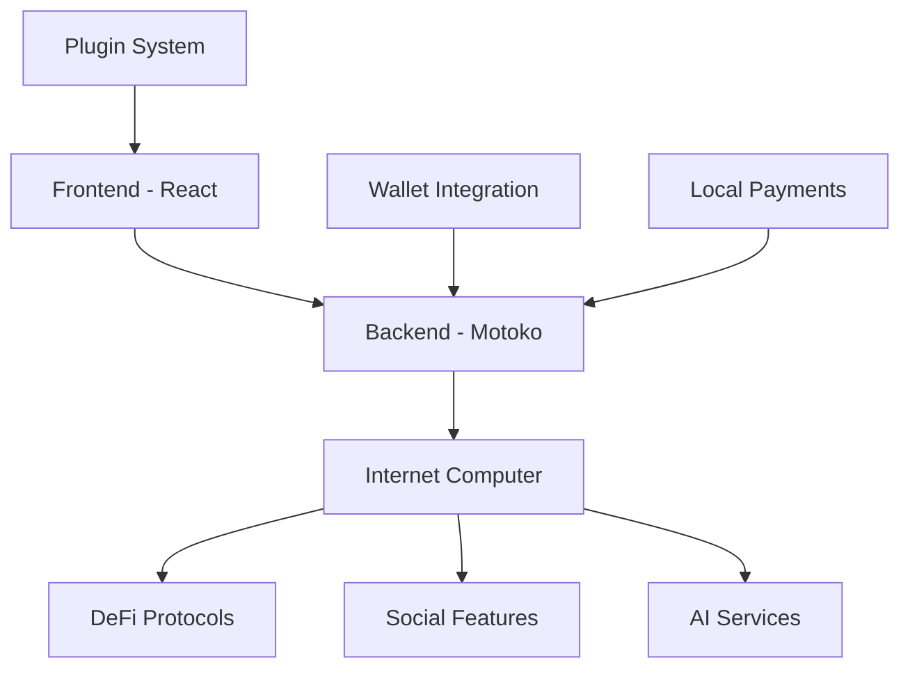

# 🚀 NISTO - The Future of Social Finance

<div align="center">


**The World's First Social Finance Platform on the Internet Computer**  
*Where DeFi Meets Social Innovation*

[](https://github.com/KezzyNgotho/Nisto/stargazers)
[](https://github.com/KezzyNgotho/Nisto/network)
[](https://github.com/KezzyNgotho/Nisto/issues)
[](https://github.com/KezzyNgotho/Nisto/pulls)
[](https://opensource.org/licenses/MIT)

</div>

---

## 🌟 Why Nisto

Nisto isn't just another DeFi platform—it's a **revolutionary social finance ecosystem** that combines the power of decentralized finance with the connectivity of social networks. Built on the Internet Computer, Nisto offers unprecedented scalability, security, and user experience.

### 🏆 **Competitive Advantages**

- **🔗 True Decentralization**: Built on Internet Computer, not just Ethereum
- **👥 Social-First Design**: Community-driven features that traditional DeFi lacks
- **🎮 Gamified Experience**: Trading games, challenges, and leaderboards
- **🤖 AI-Powered Insights**: Personalized financial recommendations
- **🔌 Extensible Ecosystem**: Plugin marketplace for developers
- **🌍 Global Accessibility**: Local payment integrations (M-Pesa, Airtel Money)
- **🛡️ Advanced Security**: Multi-method recovery and robust security

---

## 🎯 **Core Value Propositions**

### 💰 **Unified Financial Hub**
- **Multi-Currency Wallets**: Support for all major cryptocurrencies
- **DeFi Integration**: Staking, lending, yield farming in one place
- **Portfolio Analytics**: Real-time tracking and performance insights
- **Group Vaults**: Collaborative savings and investment pools

### 🎮 **Social Trading Revolution**
- **Trading Challenges**: Compete with friends and community
- **Leaderboards**: Global and local rankings
- **Social Signals**: Share strategies and insights
- **Community Vaults**: Pool resources for better yields

### 🛠️ **Developer Ecosystem**
- **Plugin Marketplace**: Build and monetize financial tools
- **Open APIs**: Integrate with existing DeFi protocols
- **Mini-App Framework**: Create specialized financial applications
- **Revenue Sharing**: Earn from your contributions

---

## 🪙 **Nisto Token (NST) - Native Platform Token**

### 🚀 **Token Overview**
The **Nisto Token (NST)** is the native utility token of the Nisto platform, designed to power the entire ecosystem and provide users with exclusive benefits, governance rights, and earning opportunities.

### 📊 **Token Specifications**
- **Symbol**: NST
- **Decimals**: 8
- **Total Supply**: 1,000,000,000,000,000 (1 Quadrillion NST)
- **Circulating Supply**: Dynamic based on minting/burning
- **Network**: Internet Computer (ICP)
- **Standard**: ERC-20 compatible interface

### 💎 **Token Features**

#### **🔄 Core Token Functions**
- **Transfer**: Send NST tokens to any address
- **Approve**: Authorize spending allowances for DeFi protocols
- **Transfer From**: Execute transfers on behalf of approved addresses
- **Mint**: Create new tokens (restricted to authorized addresses)
- **Burn**: Permanently remove tokens from circulation

#### **🏦 Staking & Rewards System**
- **Staking APY**: 5% annual percentage yield
- **Minimum Stake**: No minimum requirement
- **Lock Period**: Flexible staking with no lock-in period
- **Reward Distribution**: Automatic daily reward calculations
- **Compound Interest**: Rewards automatically compound

#### **🎯 Governance & Utility**
- **Voting Power**: Staked tokens provide governance voting rights
- **Platform Fees**: Reduced fees for NST holders
- **Exclusive Access**: Early access to new features and products
- **Premium Features**: Unlock advanced platform capabilities

### 🎨 **Token Dashboard Features**

#### **📊 Overview Tab**
- **Real-time Balance**: Live token balance display
- **Portfolio Value**: Total portfolio worth in USD
- **Market Statistics**: Price, market cap, and volume data
- **Quick Actions**: Fast access to common operations

#### **💸 Transfer Tab**
- **Send Tokens**: Transfer NST to any address
- **Receive Tokens**: Generate and share wallet addresses
- **Transaction History**: Complete transfer history with timestamps
- **Address Book**: Save and manage frequent recipients

#### **🏦 Staking Tab**
- **Stake Tokens**: Lock tokens to earn rewards
- **Unstake Tokens**: Withdraw staked tokens (no lock period)
- **Claim Rewards**: Collect earned staking rewards
- **Staking Analytics**: Performance metrics and APY tracking

#### **📈 History Tab**
- **Transfer History**: Complete list of all transfers
- **Mint History**: Track token creation events
- **Burn History**: Monitor token destruction events
- **Staking History**: Detailed staking and reward records

### 🔧 **Technical Implementation**

#### **Backend Integration (Motoko)**
```motoko
// Token state variables
private stable var tokenSymbol: Text = "NST";
private stable var tokenDecimals: Nat8 = 8;
private stable var totalSupply: Nat = 1_000_000_000_000_000;
private stable var circulatingSupply: Nat = 0;
private stable var stakingRewardRate: Float = 0.05; // 5% APY

// Core token functions
public shared({caller}) func transfer(to: Principal, amount: Nat) : async Bool
public shared({caller}) func approve(spender: Principal, amount: Nat) : async Bool
public shared({caller}) func stake(amount: Nat) : async Bool
public shared({caller}) func unstake(amount: Nat) : async Bool
public shared({caller}) func claimRewards() : async Bool
```

#### **Frontend Integration (React)**
```javascript
// Token dashboard component
import TokenDashboard from '../components/TokenDashboard';

// Backend service integration
const balance = await backendService.balanceOf(userPrincipal);
const stakingInfo = await backendService.getStakingInfo(userPrincipal);
const transferHistory = await backendService.getTransferHistory(userPrincipal);
```

### 🎯 **Use Cases & Benefits**

#### **For Users**
- **Passive Income**: Earn 5% APY through staking
- **Platform Access**: Unlock premium features and early access
- **Governance**: Participate in platform decision-making
- **Reduced Fees**: Lower transaction costs for NST holders

#### **For Developers**
- **Integration**: Easy integration with existing DeFi protocols
- **Liquidity**: Provide liquidity and earn trading fees
- **Building**: Create applications that utilize NST tokens
- **Rewards**: Earn rewards for contributing to the ecosystem

#### **For the Platform**
- **Sustainability**: Long-term tokenomics ensure platform growth
- **Community**: Strong community engagement through token incentives
- **Innovation**: Fund development through token sales and fees
- **Adoption**: Drive platform adoption through token utility

### 🔐 **Security Features**
- **Pausable**: Emergency pause functionality for security
- **Transaction Limits**: Configurable limits to prevent abuse
- **Access Control**: Role-based permissions for admin functions
- **Audit Trail**: Complete transaction history and logging
- **Multi-signature**: Enhanced security for critical operations

### 📱 **User Experience**
- **Sleek UI**: Modern, responsive token dashboard design
- **Real-time Updates**: Live balance and transaction updates
- **Mobile Optimized**: Perfect experience on all devices
- **Intuitive Navigation**: Easy-to-use interface for all users
- **Comprehensive Analytics**: Detailed insights and performance tracking

---

## 🚀 **Getting Started**

### **Prerequisites**
- Node.js 18+ 
- DFX (Internet Computer SDK) - [Install DFX](https://internetcomputer.org/docs/current/developer-docs/setup/install/)
- Git

### **Quick Start**

#### **1. Clone and Setup**
```bash
# Clone the repository
git clone https://github.com/KezzyNgotho/Nisto.git
cd Nesto

# Install root dependencies
npm install

# Install frontend dependencies
cd src/Nisto_frontend
npm install
cd ../..
```

#### **2. Start Local Development Environment**
```bash
# Start local Internet Computer replica
dfx start --background

# Wait for the replica to be ready (check with dfx ping)
dfx ping
```

#### **3. Deploy Canisters**
```bash
# Deploy all canisters (Internet Identity, Backend, Frontend)
dfx deploy

# Or deploy individually:
dfx deploy internet_identity
dfx deploy Nisto_backend
dfx deploy Nisto_frontend
```

#### **4. Build and Deploy Frontend**
```bash
# Build the frontend
cd src/Nisto_frontend
npm run build

# Deploy the updated frontend
cd ../..
dfx deploy Nisto_frontend
```

#### **5. Access Your Application**
```bash
# Get the frontend URL
dfx canister id Nisto_frontend

# Open in browser: http://localhost:4943/?canisterId=<FRONTEND_CANISTER_ID>
```

---

## 📋 **Current Canister IDs**

### **Local Development Environment**
```bash
# Internet Identity Canister
internet_identity: ucwa4-rx777-77774-qaada-cai

# Backend Canister  
Nisto_backend: uzt4z-lp777-77774-qaabq-cai

# Frontend Canister
Nisto_frontend: umunu-kh777-77774-qaaca-cai
```

### **Environment Variables**
The following environment variables are automatically set in `.env`:
```bash
CANISTER_ID_INTERNET_IDENTITY=ucwa4-rx777-77774-qaada-cai
CANISTER_ID_NISTO_BACKEND=uzt4z-lp777-77774-qaabq-cai
CANISTER_ID_NISTO_FRONTEND=umunu-kh777-77774-qaaca-cai
```

---

## 🔧 **Development Workflow**

### **Backend Development (Motoko)**
```bash
# Edit backend code
code src/Nisto_backend/main.mo

# Deploy backend changes
dfx deploy Nisto_backend

# Check backend status
dfx canister status Nisto_backend

# View backend logs
dfx canister call Nisto_backend greet '("World")'
```

### **Frontend Development (React)**
```bash
# Start development server
cd src/Nisto_frontend
npm start

# Build for production
npm run build

# Deploy frontend changes
cd ../..
dfx deploy Nisto_frontend
```

### **Internet Identity Setup**
```bash
# Check Internet Identity status
dfx canister status internet_identity

# Access Internet Identity interface
# http://localhost:4943/?canisterId=uzt4z-lp777-77774-qaabq-cai
```

---

## 🏗️ **Architecture**

<div align="center">



</div>

### **Tech Stack**
- **Frontend**: React 18, JavaScript, Vite, SCSS
- **Backend**: Motoko (Internet Computer)
- **Authentication**: Internet Identity
- **Styling**: Modern CSS with animations
- **Deployment**: Internet Computer canisters

---

## 🏗️ **Detailed Module Architecture**

### **Backend Modules (Motoko)**

#### **🔐 Authentication & Security Module**
- **User Management**: Complete user lifecycle with preferences and settings
- **Recovery System**: Multi-method account recovery (email, phone, security questions, emergency contacts)
- **Session Management**: Secure login sessions with device tracking
- **Audit Logging**: Comprehensive security audit trails
- **Two-Factor Authentication**: Enhanced security with 2FA support

#### **💰 Wallet & Transaction Module**
- **Multi-Currency Wallets**: Support for Bitcoin, Ethereum, Internet Computer, and more
- **External Wallet Integration**: Connect existing wallets (MetaMask, WalletConnect)
- **Transaction Management**: Complete transaction lifecycle with status tracking
- **Portfolio Analytics**: Real-time balance tracking and performance metrics
- **Address Management**: Unlimited wallet addresses with labeling

#### **🏦 DeFi Integration Module**
- **Protocol Support**: Integration with major DeFi protocols
- **Yield Farming**: Automated yield optimization strategies
- **Lending & Borrowing**: Collateralized lending with competitive rates
- **Staking Rewards**: Passive income through staking mechanisms
- **Position Tracking**: Real-time DeFi position monitoring

#### **👥 Group Vaults Module**
- **Vault Creation**: Customizable vault types (savings, investment, emergency)
- **Member Management**: Role-based access control (owner, admin, member)
- **Transaction Approval**: Multi-signature transaction workflows
- **Contribution Tracking**: Automated contribution and withdrawal tracking
- **Vault Analytics**: Performance metrics and member activity

#### **🎮 Social Gaming Module**
- **Trading Challenges**: Competitive trading competitions
- **Game Types**: Various game modes (daily, weekly, tournament)
- **Participant Management**: Player registration and tracking
- **Reward System**: Token rewards and leaderboard rankings
- **Game History**: Complete game and participant history

#### **🤖 AI Assistant Module**
- **Message Types**: Support for text, voice, and structured data
- **Insight Generation**: Personalized financial insights and analysis
- **Recommendation Engine**: AI-powered investment recommendations
- **Risk Assessment**: Portfolio risk analysis and alerts
- **Learning System**: Continuous improvement from user interactions

#### **💳 Local Payment Module**
- **Payment Providers**: Integration with M-Pesa, Airtel Money, and more
- **Transaction Processing**: Complete payment lifecycle management
- **Status Tracking**: Real-time payment status updates
- **Fee Management**: Transparent fee structure and calculations
- **Compliance**: Regulatory compliance and reporting

#### **🔌 Plugin Marketplace Module**
- **Plugin Management**: Complete plugin lifecycle (create, install, update, remove)
- **Category System**: Organized plugin categories (trading, analytics, gaming)
- **Permission System**: Granular permission controls
- **User Plugin States**: Individual user plugin configurations
- **Review System**: Plugin ratings and user reviews

### **Frontend Modules (React)**

#### **📊 Dashboard Module**
- **Overview Tab**: Real-time portfolio summary and quick actions
- **Activity Feed**: Recent transactions and social interactions
- **Statistics Display**: User stats and performance metrics
- **Notification Center**: Real-time notifications and alerts
- **Responsive Design**: Mobile-first responsive layout

#### **🔐 Authentication Module**
- **Login Modal**: Internet Identity integration
- **Recovery Setup**: Multi-step recovery method configuration
- **Security Settings**: Two-factor authentication and privacy controls
- **Session Management**: Automatic session handling and refresh

#### **💰 Wallet Management Module**
- **Wallet Overview**: Multi-currency wallet dashboard
- **Transaction History**: Complete transaction tracking
- **Address Management**: Generate and manage wallet addresses
- **Portfolio Analytics**: Performance charts and metrics

#### **🏦 DeFi Tools Module**
- **Protocol Integration**: Connect to DeFi protocols
- **Position Management**: Monitor and manage DeFi positions
- **Yield Farming**: Automated yield optimization
- **Risk Assessment**: Portfolio risk analysis

#### **👥 Social Features Module**
- **Group Vaults**: Collaborative savings and investment
- **Trading Games**: Competitive trading challenges
- **Leaderboards**: Global and local rankings
- **Social Feed**: Community interactions and updates

#### **🔌 Plugin Marketplace Module**
- **Plugin Discovery**: Browse and search plugins
- **Installation Management**: Install and configure plugins
- **User Reviews**: Rate and review plugins
- **Developer Tools**: Plugin development resources

---

## 🚀 **Production Deployment**

### **Deploy to Mainnet**
```bash
# Switch to mainnet
dfx deploy --network ic

# Set production environment variables
export DFX_NETWORK=ic

# Deploy canisters to mainnet
dfx deploy internet_identity --network ic
dfx deploy Nisto_backend --network ic
dfx deploy Nisto_frontend --network ic
```

### **Environment Configuration**
```bash
# Production environment variables
DFX_NETWORK=ic
CANISTER_ID_INTERNET_IDENTITY=rdmx6-jaaaa-aaaaa-aaadq-cai  # Mainnet Internet Identity
```

---

## 🔧 **Troubleshooting**

### **Common Issues**

#### **1. DFX Not Found**
```bash
# Install DFX
sh -ci "$(curl -fsSL https://internetcomputer.org/install.sh)"
```

#### **2. Canister Deployment Fails**
```bash
# Check replica status
dfx ping

# Restart replica
dfx stop
dfx start --background

# Clean and redeploy
dfx canister delete --all
dfx deploy
```

#### **3. Frontend Build Issues**
```bash
# Clear node modules and reinstall
cd src/Nisto_frontend
rm -rf node_modules package-lock.json
npm install

# Rebuild
npm run build
```

#### **4. Internet Identity Issues**
```bash
# Check Internet Identity status
dfx canister status internet_identity

# Redeploy Internet Identity
dfx deploy internet_identity
```

### **Useful Commands**
```bash
# Check all canister statuses
dfx canister status --all

# View canister logs
dfx canister call Nisto_backend greet '("Hello")'

# Get canister IDs
dfx canister id internet_identity
dfx canister id Nisto_backend
dfx canister id Nisto_frontend

# Check replica health
dfx ping

# View replica logs
dfx logs
```

---

## 📚 **API Documentation**

### **Backend API Endpoints**

#### **Authentication**
- `loginOrCreateUser()` - Login or create new user
- `getUser()` - Get current user data
- `updateUser(displayName, avatar)` - Update user profile

#### **Recovery System**
- `addRecoveryMethod(methodType, value, metadata)` - Add recovery method
- `getUserRecoveryMethods()` - Get user recovery methods
- `initiateRecovery(identifier, recoveryMethod)` - Start recovery process
- `verifyRecovery(recoveryRequestId, verificationCode, securityAnswers)` - Verify recovery

#### **Wallet Management**
- `createCryptoWallet(name, currency, isExternal, externalWalletType, metadata)` - Create wallet
- `getUserCryptoWallets()` - Get user wallets
- `updateCryptoWalletBalance(walletId, newBalance)` - Update wallet balance

#### **Group Vaults**
- `createVault(name, description, vaultType, currency, isPublic, targetAmount, rules, metadata)` - Create vault
- `getUserVaults()` - Get user vaults
- `depositToVault(vaultId, amount, description)` - Deposit to vault
- `withdrawFromVault(vaultId, amount, description)` - Withdraw from vault

#### **DeFi Integration**
- `createDeFiPosition(productType, protocol, amount, currency, strategy, metadata)` - Create DeFi position
- `getUserDeFiPositions()` - Get user DeFi positions
- `updateDeFiPosition(positionId, newAmount, newStrategy)` - Update position

#### **Local Payments**
- `initiateLocalPayment(provider, type, amount, currency, recipientPhone, recipientName, reference)` - Start payment
- `getUserPaymentHistory()` - Get payment history
- `addPaymentMethod(provider, accountNumber, phoneNumber, accountName, isDefault)` - Add payment method

#### **AI Assistant**
- `sendAIMessage(messageType, content, metadata)` - Send AI message
- `getAIConversationHistory()` - Get conversation history
- `generateAIInsights()` - Generate insights
- `getAIRecommendations()` - Get recommendations

#### **Plugin System**
- `installPlugin(pluginId)` - Install plugin
- `getUserPlugins()` - Get user plugins
- `updatePluginSettings(pluginId, settings)` - Update plugin settings

#### **Nisto Token (NST)**
- `getTokenMetadata()` - Get token metadata (symbol, decimals, total supply)
- `balanceOf(owner: Principal)` - Get token balance for address
- `getTotalBalance(owner: Principal)` - Get total balance including staked tokens
- `allowance(owner: Principal, spender: Principal)` - Get spending allowance
- `transfer(to: Principal, amount: Nat)` - Transfer tokens to address
- `approve(spender: Principal, amount: Nat)` - Approve spending allowance
- `transferFrom(from: Principal, to: Principal, amount: Nat)` - Transfer on behalf
- `mint(to: Principal, amount: Nat)` - Create new tokens (admin only)
- `burn(amount: Nat)` - Destroy tokens from sender's balance
- `stake(amount: Nat)` - Stake tokens to earn rewards
- `unstake(amount: Nat)` - Unstake tokens (no lock period)
- `claimRewards()` - Claim earned staking rewards
- `getStakingInfo(owner: Principal)` - Get staking information and rewards
- `getTotalStaked()` - Get total tokens staked across platform
- `getTransferHistory(owner: Principal)` - Get transfer transaction history
- `getMintHistory()` - Get token minting history
- `getBurnHistory()` - Get token burning history

---

## 🤝 **Contributing**

### **Development Setup**
1. Fork the repository
2. Create a feature branch: `git checkout -b feature/amazing-feature`
3. Make your changes
4. Test thoroughly
5. Commit your changes: `git commit -m 'Add amazing feature'`
6. Push to the branch: `git push origin feature/amazing-feature`
7. Open a Pull Request

### **Code Style**
- Follow Motoko best practices for backend code
- Use modern React patterns for frontend code
- Write comprehensive tests
- Document all public APIs

### **Testing**
```bash
# Run backend tests
dfx canister call Nisto_backend test

# Run frontend tests
cd src/Nisto_frontend
npm test
```

---

## 📄 **License**

This project is licensed under the MIT License - see the [LICENSE](LICENSE) file for details.

---

## 🙏 **Acknowledgments**

- **Internet Computer Foundation** for the revolutionary blockchain platform
- **DFINITY** for the Motoko programming language
- **React Team** for the amazing frontend framework
- **Open Source Community** for inspiration and support

---

## 📞 **Support**

- **Documentation**: [Wiki](https://github.com/KezzyNgotho/Nisto/wiki)
- **Issues**: [GitHub Issues](https://github.com/KezzyNgotho/Nisto/issues)
- **Discussions**: [GitHub Discussions](https://github.com/KezzyNgotho/Nisto/discussions)
- **Email**: nistodefi@gmail.com

---

<div align="center">

**Built with ❤️ by the Nisto Team**

[](https://twitter.com/nisto)
[](https://discord.gg/nisto)
[](https://t.me/nisto_defi)

</div>
